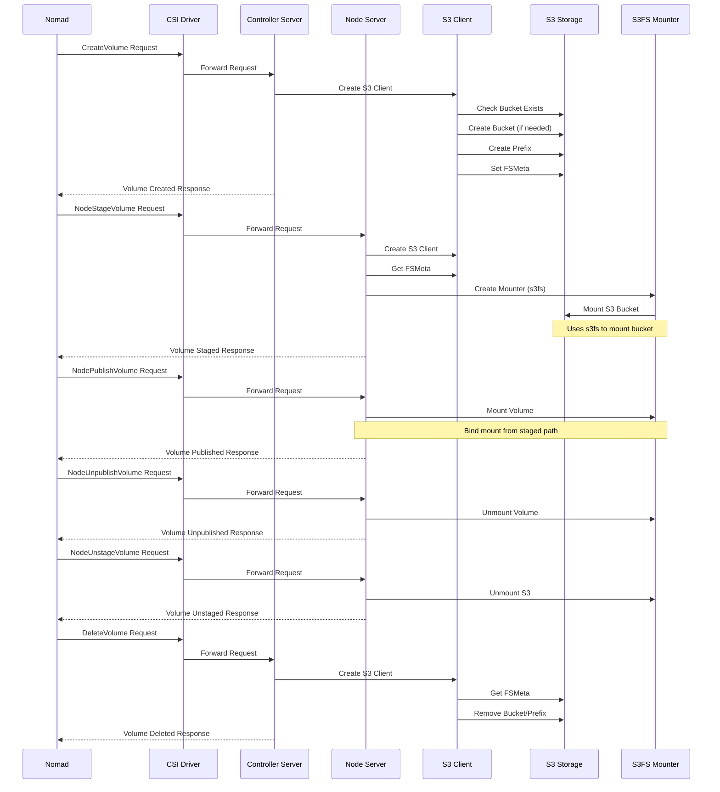

# Nomad CSI S3 Plugin

⚠️ **WARNING: This plugin is experimental and should be used in production environments at your own risk.** ⚠️

A Container Storage Interface (CSI) plugin that allows the use of S3-compatible storages as persistent volumes in Nomad clusters.

## Overview

This plugin enables you to:

- Mount S3 buckets as persistent volumes in your Nomad tasks
- Support multiple S3-compatible storage backends
- Use shared storage across multiple nodes
- Configure access through credentials or aliases

## Architecture



## Prerequisites

- Nomad 1.3.0 or later
- An S3-compatible storage service (AWS S3, MinIO, etc.)

## Installation

The plugin is distributed as a Docker image that includes all necessary dependencies:

```bash
docker pull mwantia/nomad-csi-s3-plugin:latest
```

## Configuration

### Plugin Configuration (Optional)

You can optionally configure S3 backend aliases in a configuration file (`config.yml`):

```yaml
aliases:
  - name: minio
    endpoint: http://minio:9000
    region: ""
    accessKeyID: minioadmin
    secretAccessKey: minioadmin
```

This configuration file needs to be defined via `--config=<path>` flag.

### Volume Configuration Parameters

| Parameter | Description | Required | Default |
|-----------|-------------|----------|---------|
| `mounter` | Mount implementation to use | No | `s3fs` |
| `usePrefix` | Use volume prefix instead of bucket | No | `false` |
| `bucket` | Override bucket name | No | VolumeID |
| `prefix` | Custom prefix for bucket | No | VolumeID |

Currently, only `s3fs` has been implemented.

### Volume Configuration Secrets

| Secret | Description | Required | Default |
|--------|-------------|----------|---------|
| `endpoint` | Defined the target s3-endpoint | If `alias` undefined | `` |
| `region` | Defined which region should be used for the s2 endpoint | No | `""` |
| `accessKeyID` | Defines the **accessKeyID** used for authentification | If `alias` undefined | `` |
| `secretAccessKey` | Defines the **secretAccessKey** used for authentification | If `alias` undefined | `` |
| `alias` | Use an **alias** defined in config to use as authentification | No | `` |

### Nomad Job Configuration

A list of examples can be found under `examples/nomad`.

## Features

- Support for multiple S3-compatible storage backends
- Configurable mount options
- Multiple access modes:
  - Single node writer
  - Multi-node multi-writer
- Credential management through secrets or aliases
- Support for bucket prefixing

## Limitations

- Volume expansion is not currently supported
- Performance depends heavily on network conditions and S3 backend
- Some S3 features might not be supported depending on the backend used

## Troubleshooting

Common issues and solutions:

1. Mount failures
   - Check S3 credentials and endpoint configuration
   - Verify container has proper privileges
   - Ensure proper permissions on mount directories

2. Performance issues
   - Consider using a closer S3 endpoint
   - Check network conditions
   - Verify S3 backend performance

## Contributing

Contributions are welcome! Please feel free to submit a Pull Request.

## License

This project is licensed under the Apache License 2.0 - see the LICENSE file for details.
